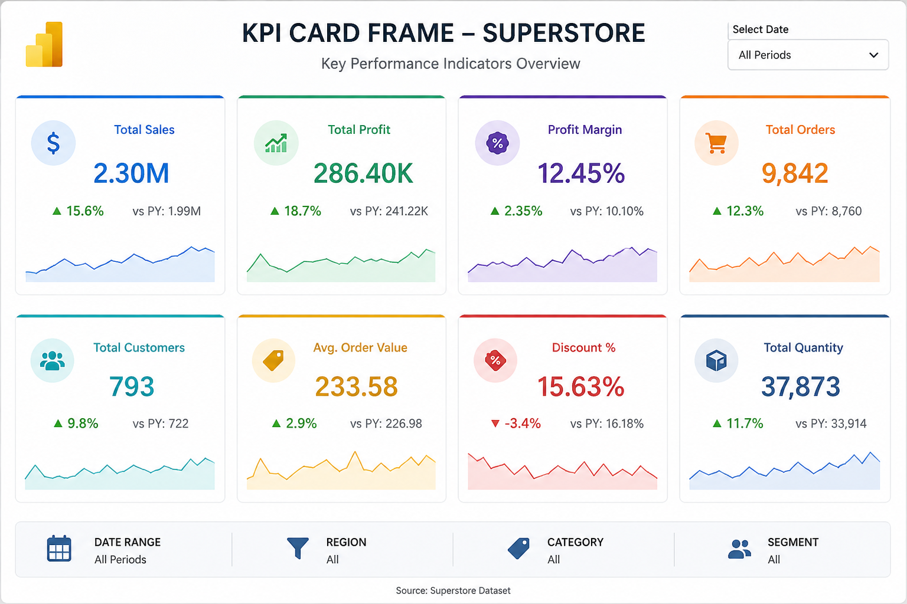

# 📊 Superstore Sales Analysis

## 📌 Objective
Analyze retail sales data to identify trends, profit drivers, and business insights.

---

## 📂 Dataset
Superstore dataset (Kaggle)

---

## 🧠 Approach
- SQL used for data querying and aggregation  
- Python used for data analysis and visualization  
- Power BI used for dashboard creation  

---

## 📊 Key Insights
- Technology category generated highest sales  
- Some products have negative profit due to high discount  
- West region performed best in terms of profit  

---

## 📸 Dashboard

---

## 🚀 Tools Used
- SQL  
- Python (Pandas, Matplotlib)  
- Power BI  

---

## 💡 Conclusion
This project highlights how data analysis can uncover hidden patterns and help businesses improve profitability.
